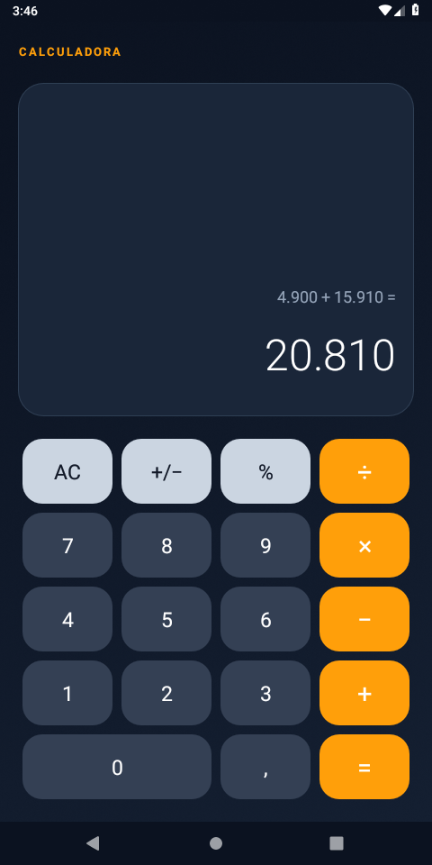

# Calculadora Kotlin

Aplicativo Android de calculadora desenvolvido em Kotlin para a **Atividade 06**.

Disciplina: Desenvolvimento de Sistemas para Dispositivos Móveis.



Print capturado no emulador Android 9 (API 28), com o aplicativo instalado e executando `4.900 + 15.910 = 20.810`.

[Baixar APK](https://github.com/Querley/calculadora-kotlin/releases/latest/download/app-debug.apk) · [Baixar print para entrega](https://github.com/Querley/calculadora-kotlin/releases/latest/download/calculadora-executando.png)

## Funcionalidades

- Soma, subtração, multiplicação e divisão
- Porcentagem e alteração de sinal
- Expressão realizada exibida na área superior
- Resultado em destaque
- Tratamento de divisão por zero
- Interface responsiva inspirada nos layouts fornecidos
- Preservação do cálculo ao girar a tela

## Uso

Digite um número, escolha a operação, digite o segundo número e toque em `=`. O botão `AC` limpa o cálculo e `+/−` troca o sinal do número atual.

A porcentagem sozinha divide o número por 100. Em adições e subtrações, é calculada sobre o primeiro valor: `200 + 10% = 220` e `200 − 10% = 180`. Em multiplicações e divisões, o segundo número é convertido para sua forma decimal: `200 × 10% = 20`.

As operações encadeadas são resolvidas na ordem em que os botões são pressionados, como em uma calculadora básica. Os valores usam `BigDecimal`; divisões são arredondadas para até 12 casas decimais. A entrada aceita até 15 dígitos por número. Valores longos podem ser consultados deslizando o visor horizontalmente.

## Como executar

1. Abra o projeto no Android Studio.
2. Aguarde a sincronização do Gradle.
3. Execute em um dispositivo ou emulador com Android 6.0 (API 23) ou superior.

Também é possível gerar o APK pelo terminal:

```bash
./gradlew assembleDebug
```

O APK será criado em `app/build/outputs/apk/debug/app-debug.apk`.

Um APK pronto para instalação também está disponível na seção **Releases** deste repositório.

## Verificação

O projeto passou em 18 testes automatizados e na análise `lintDebug`, sem erros. Também foi executado no emulador Android 9, verificando soma, casas decimais, divisão por zero e preservação do resultado após a rotação.

Para compilar e executar os testes no Windows:

```powershell
.\gradlew.bat assembleDebug testDebugUnitTest lintDebug
```

O teste de renderização salva uma imagem auxiliar em `app/build/reports/preview/`. O print da pasta `docs` foi capturado diretamente do emulador e não é substituído pelos testes.
